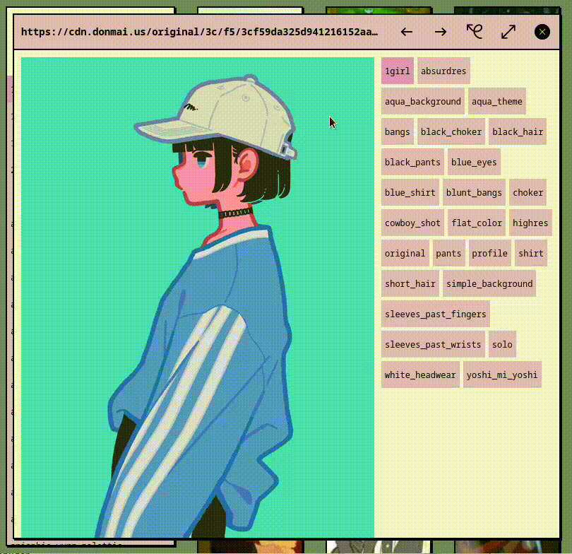
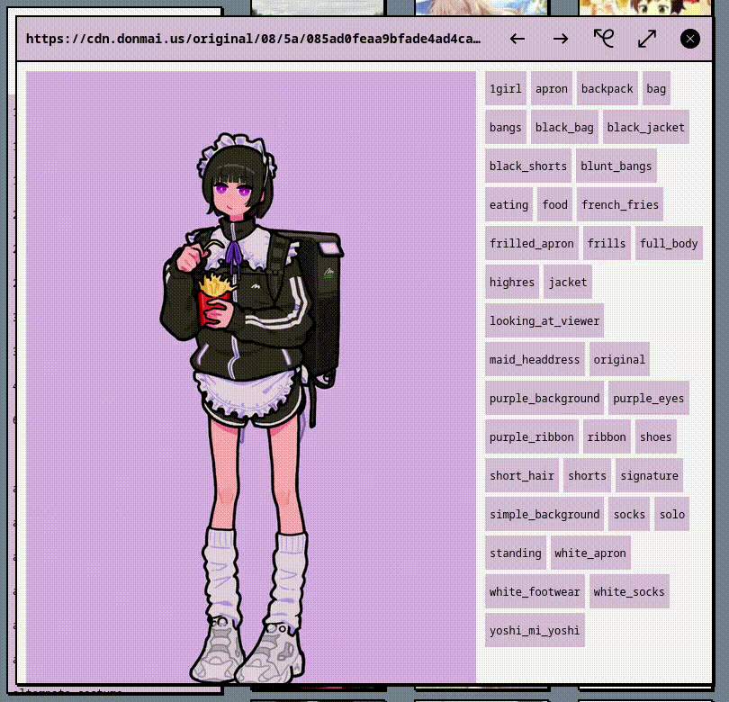
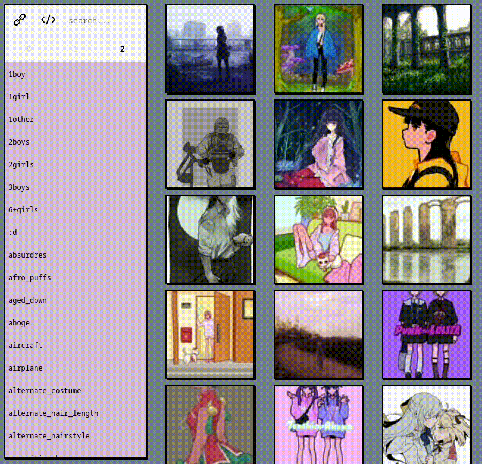

# ブラウザ (burauza)
go find yourself some pictures at [burauza.deno.dev](https://burauza.deno.dev/).

## navigation
### navigation bar
*  choose from source/ edit sources
*  go to github page

### window
*  /  maximize/ minimize window
*  close window

### window: preview
*  go to previous image
*  go to next image
*  open source in new tab

### window: source editor
*  download sources as JSON
*  save source
*  delete source
*  add source
*  upload sources in JSON format

## screenshots

## recordings
### show wiki

### min/ max window

### add tag 

## how do i add new sources?
"_imapervert_"

you are able to see a new button in the navigation.

## assets
icons by [icons8](https://icons8.com/)