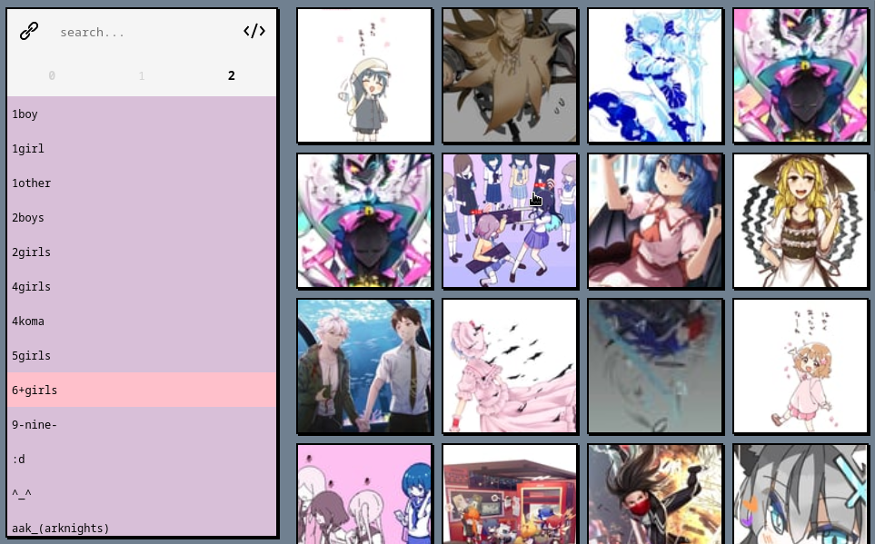

# ブラウザ (burauza)
go find yourself some pictures at [burauza.deno.dev](https://burauza.deno.dev/).

## how do i add new sources?
"_imapervert_"

you are able to see a new button in the navigation.

## screenshots

## assets
icons by [icons8](https://icons8.com/)